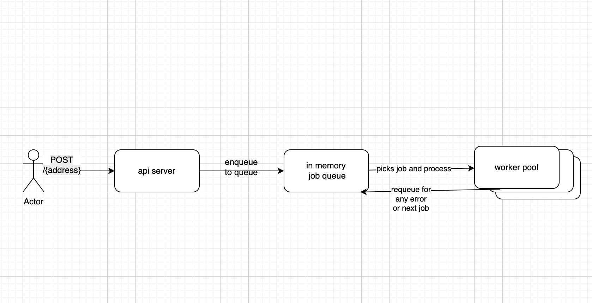

# Project

This project is a Go-based application designed to fetch and process transaction histories for cryptocurrency addresses. It supports fetching external, internal, and token transfer transactions, and saving them in csv.

---

## Table of Contents
1. [Getting Started](#getting-started)
2. [Project Structure](#project-structure)
3. [API Endpoints](#api-endpoints)
4. [Command Line Utility](#command-line-utility)
5. [Assumptions](#assumptions)
6. [Interesting Architecture Decisions](#interesting-architecture-decisions)


---

## Getting Started

### Prerequisites
- Go 1.20+ installed on your system
- A working internet connection to fetch dependencies
- A configured `.env` file for API keys and other configurations (if required)

### Installation
1. Clone the repository:
   ```bash
   git clone https://github.com/singhpranshu/cointracker.git
   cd cointracker
   ```

2. Install dependencies:
   ```bash
   go mod tidy
   ```

3. Run the application:
   ```bash
   go run .
   ```

4. The server will start on `http://localhost:3000`.

---

## Project Structure

```
cointracker/
├── client/                 # Contains client logic for external API calls
├── config/                 # Configuration management
├── controllers/            # API handlers and business logic
├── dto/                    # Data Transfer Objects for API responses
├── model/                  # Core data models
├── queue/                  # Job queue implementation
├── main.go                 # Entry point for the application
└── router.go               # Router setup
```

---

## API Endpoints

### 1. **GET /{address}/history?type={external|internal|token}&page={page_number|""}**
Fetches the transaction history for a given address.

#### Query Parameters:
- `type`: Type of transaction (`external`, `internal`, `token`)
- `page`: Page number for paginated results

#### Example:
```bash
curl "http://localhost:3000/0xa39b189482f984388a34460636fea9eb181ad1a6/history?type=external&page="
```

---

### 2. **POST /{address}/history**
Enqueues an address for processing its full transaction history.

#### Example:
```bash
curl -X POST "http://localhost:3000/0xa39b189482f984388a34460636fea9eb181ad1a6/history"
```

---

## Command Line Utility
this will add address in queue and start processing
```
go run . -address=0xa39b189482f984388a34460636fea9eb181ad1a6
```

---

## Assumptions

1. **Transaction Types:**
   - The application assumes three types of transactions: `external`, `internal`, and `token`. Any other type will result in an error.
   - It is creating three csv files for all above types.

2. **Api data traversal:**
   - The application fetches a maximum of 50 transactions per page as blockscount only supports that.
   - have mapped the response value from api to transaction type according to response. 

---

## Interesting Architecture Decisions

1. **Separation of Concerns:**
   - The project is structured to separate concerns between clients, controllers, models, and DTOs. This makes the codebase modular and easier to maintain.

2. **multiple ways of generating history**
   - You can use api to generate history.
   - or can also use command line.

3. **Concurrency with Goroutines:**
   - The `ProcessHistoryForAddress` function uses goroutines to process transaction types in parallel, leveraging Go's concurrency model.

4. **Job Queue:**
   - A custom in-memory job queue is implemented to handle background processing of addresses. This design allows for future scalability by replacing it with a distributed queue system like Kafka.

5. **Worker Pool**
   - WorkerPool ensures that multiple job can be process in parallel while ensuring processing at max n jobs at a time.
     here n is no of cores present in cpu which is fetched through runtime.NumCPU().
   - job append to the file for every batch (address + type + .csv)


        

---
